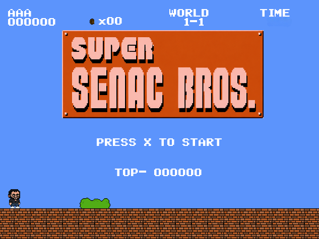
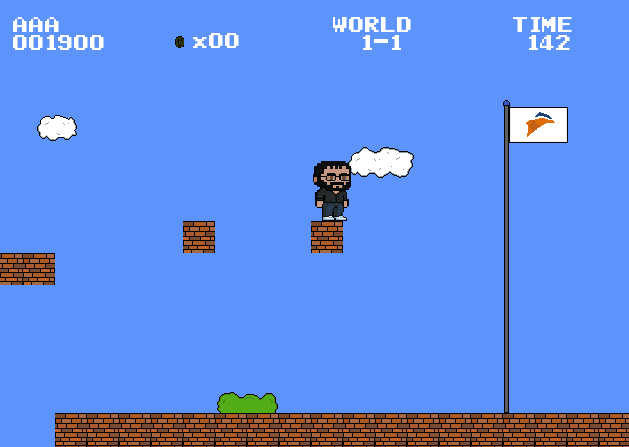
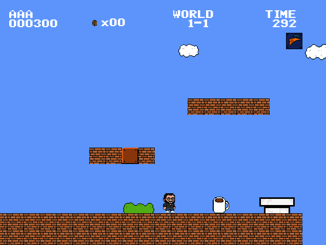
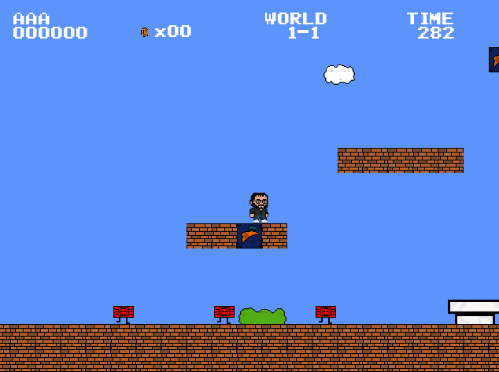
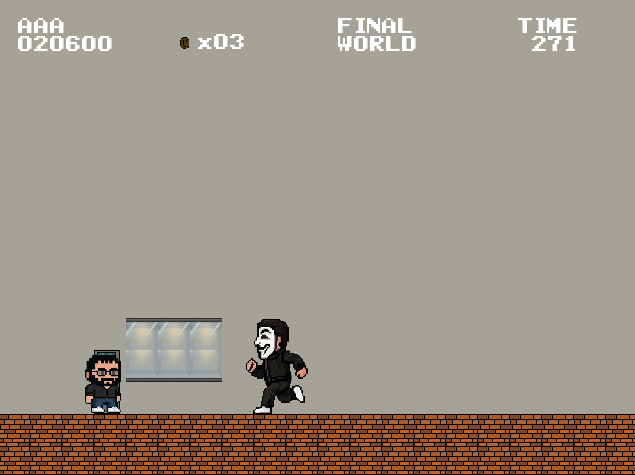

# SuperSenacBros

> Um jogo de plataforma 2D desenvolvido em Java com o auxílio do ecossistema LibGDX. 
> O projeto traz a nostalgia dos clássicos de plataforma, combinando mecânicas de movimento dinâmicas, gerenciamento de menus e compatibilidade total com teclados e gamepads.

---

## 📸 Pré-visualização do Jogo

---

## ⚡ Principais Recursos

* **Sistema de Física e Movimentação:** Cálculos de gravidade, pulos fluidos e detecção precisa de colisões com o cenário.
* **Compatibilidade com Gamepads:** Conecte seu controle (Xbox, PlayStation ou genéricos) e jogue utilizando tanto os direcionais analógicos quanto o D-Pad.
* **Menus Dinâmicos:** Interface no estilo arcade com navegação interativa e gerenciamento de telas.
* **Integração com Tiled:** Fases e mapas desenhados profissionalmente utilizando o Tiled Map Editor (`.tmx`).
* **Gerenciamento de Partida:** Sistema completo de pontuação, controle de vidas, telas de Game Over e reinício ágil.

---

## 🛠️ Stack Tecnológica

* **Linguagem:** Java (JDK 11 ou superior)
* **Framework / Engine:** LibGDX
* **Ferramenta de Build:** Gradle
* **Editor de Mapas:** Tiled Map Editor
* **Banco de Dados (Scores):** MySQL *(utilizando o script `PLAYERS_DB.sql`)*

---

## 🎮 Controles

O jogo identifica automaticamente o dispositivo que você estiver utilizando!

| Ação | Teclado | Controle (Xbox / PS) |
| :--- | :--- | :--- |
| **Movimentação** | Setas (Esquerda / Direita) ou `A` / `D` | Analógico Esquerdo / D-Pad |
| **Pular** | Seta para Cima, `W` ou Espaço | Botão `A` (Xbox) / `X` (PlayStation) |
| **Confirmar (Menus)** | Tecla `Enter` | Botão `A` (Xbox) / `X` (PlayStation) |
| **Reiniciar (Game Over)** | Tecla `Enter` | Botão `B` (Xbox) / `O` (PlayStation) |

---

## 🗄️ Configuração do Banco de Dados (Scores)

Para habilitar o salvamento de pontuações locais dos jogadores:
1. Importe e execute o script contido no arquivo `PLAYERS_DB.sql` no seu servidor MySQL local.
2. Certifique-se de que as credenciais de conexão correspondem ao seu ambiente de testes.

---

## 👥 Equipe de Desenvolvimento

* **Arthur Cardoso Padilha** — Lógica e Desenvolvimento ([@Padilh4](https://github.com/Padilh4))
* **Carlos Henrique Cardozo** — Criação de Texturas e Design de Mapas 
* **Mizael Da Rosa Giehl** — Design Principal ([@Mizael-Giehl](https://github.com/Mizael-Giehl))

---

*Desenvolvido com muito código, dedicação e algumas horas de negociação com o Gradle! 👾*
